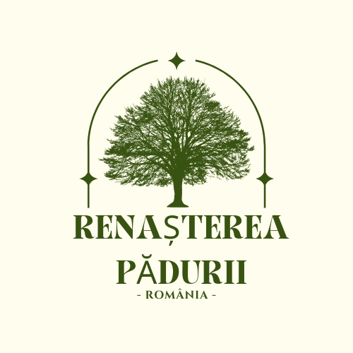

<!DOCTYPE html>
<html lang="ro">
<head>
  <meta charset="UTF-8">
  <meta name="viewport" content="width=device-width, initial-scale=1.0">
  <title>Renașterea Pădurii</title>
  <link rel="stylesheet" href="style.css">
</head>
<body>
  <!-- Header și navigație -->
  <header>
    

      
    

    <nav>
      <ul>
        <li><a href="#acasa">Acasă</a></li>
        <li><a href="#despre">Despre noi</a></li>
        <li><a href="#noutati">Noutăți</a></li>
        <li><a href="#contact">Contact</a></li>
      </ul>
    </nav>
  </header>

  

  <!-- Sectiunea Despre noi -->
  <section id="despre">
    <h2>Despre noi</h2>
  
Ocolul silvic ”Renașterea Pădurii” din Mârșani este un ocol silvic de regim care a fost înființat pe 20 iulie 2009.

  </section>

  <!-- Sectiunea Noutăți -->
<section id="noutati">
    <h2>Noutăți</h2>
  
    

      <!-- Articol 1 -->
      

        
        <h3>Titlul primului articol</h3>
        
Acesta este un scurt rezumat al primului articol. Continuă să citești pentru mai multe detalii.

        <a href="#" class="read-more">Citește mai mult</a>
      

  
      <!-- Articol 2 -->
      

        
        <h3>Titlul celui de-al doilea articol</h3>
        
Un alt rezumat scurt al unui articol interesant despre păduri și natura noastră. Citește mai mult!

        <a href="#" class="read-more">Citește mai mult</a>
      

  
      <!-- Articol 3 -->
      

        
        <h3>Titlul celui de-al treilea articol</h3>
        
Articolul acesta vorbește despre inițiativele recente de reîmpădurire. Detalii mai jos!

        <a href="#" class="read-more">Citește mai mult</a>
      

    

  </section>
  

   <!-- Sectiunea Contact -->
<section id="contact">
    <h2>Contact</h2>
    
    

      
<strong>Telefon:</strong> <a href="tel:+40700123456">+40 700 123 456</a>

      
<strong>Email:</strong> <a href="mailto:contact@renastereapadurii.ro">contact@renastereapadurii.ro</a>

    

  
    <form id="contact-form">
      <label for="name">Nume:</label>
      <input type="text" id="name" name="name" required>
  
      <label for="email">Email:</label>
      <input type="email" id="email" name="email" required>
  
      <label for="message">Mesaj:</label>
      <textarea id="message" name="message" required></textarea>
  
      <button type="submit">Trimite mesajul</button>
    </form>
  </section>
  

  

  <footer>
    
&copy; 2024 Renașterea Pădurii. Toate drepturile rezervate.

  </footer>

  
</body>
</html>

/* Resetare stiluri */
* {
    margin: 0;
    padding: 0;
    box-sizing: border-box;
  }
  
  /* Stiluri de bază */
  body {
    font-family: Arial, sans-serif;
    background-color: #f0f0f0;
    color: #333;
  }
  
  /* Header */
  header {
    background-color: #3c763d;
    padding: 20px;
    text-align: center;
  }
  
  header .logo img {
    max-width: 150px;
  }
  
  nav ul {
    list-style: none;
  }
  
  nav ul li {
    display: inline-block;
    margin: 0 15px;
  }
  
  nav ul li a {
    color: white;
    text-decoration: none;
    font-weight: bold;
  }
  
  /* Secțiuni */
  section {
    padding: 50px;
    text-align: center;
  }
  
  h1, h2 {
    margin-bottom: 20px;
    color: #3c763d;
  }
  
  .image-slider img {
    width: 100%;
    height: auto;
  }
  
  #articles {
    margin-top: 30px;
  }
  
  article {
    border: 1px solid #ccc;
    padding: 20px;
    margin-bottom: 20px;
  }
  
  footer {
    background-color: #333;
    color: white;
    padding: 20px;
    text-align: center;
  }
  
  /* Formular */
  form {
    margin-top: 20px;
  }
  
  form label {
    display: block;
    margin: 10px 0 5px;
  }
  
  form input, form textarea {
    width: 100%;
    padding: 10px;
    margin-bottom: 20px;
    border: 1px solid #ccc;
  }
  
  form button {
    padding: 10px 20px;
    background-color: #3c763d;
    color: white;
    border: none;
    cursor: pointer;
  }
  
  form button:hover {
    background-color: #2f5d2d;
  }
  
  /* Sectiunea Contact */
#contact {
    padding: 50px;
    background-color: #f9f9f9;
    text-align: center; /* Centrare text */
  }
  
  #contact h2 {
    color: #3c763d;
    margin-bottom: 40px;
  }
  
  .contact-info {
    margin-bottom: 40px;
  }
  
  .contact-info p {
    margin-bottom: 20px;
    font-size: 18px;
    color: #333;
  }
  
  .contact-info a {
    color: #3c763d;
    text-decoration: none;
  }
  
  /* Centrare formular */
  form {
    max-width: 600px;
    margin: 0 auto; /* Centrare orizontală */
    padding: 20px;
    background-color: #fff;
    box-shadow: 0px 4px 8px rgba(0, 0, 0, 0.1);
    border-radius: 8px;
  }
  
  form label {
    display: block;
    margin-bottom: 10px;
    color: #333;
  }
  
  form input, form textarea {
    width: 100%;
    padding: 10px;
    margin-bottom: 20px;
    border: 1px solid #ccc;
    font-size: 16px;
    border-radius: 5px;
  }
  
  form button {
    padding: 10px 20px;
    background-color: #3c763d;
    color: white;
    border: none;
    cursor: pointer;
    font-size: 16px;
    border-radius: 5px;
  }
  
  form button:hover {
    background-color: #2f5d2d;
  }

  /* Sectiunea Noutăți */
#noutati {
    padding: 50px;
    background-color: #f9f9f9;
    text-align: center;
  }
  
  #noutati h2 {
    color: #3c763d;
    margin-bottom: 40px;
  }
  
  .articles-grid {
    display: grid;
    grid-template-columns: repeat(auto-fit, minmax(300px, 1fr));
    gap: 20px;
  }
  
  .article-card {
    background-color: #fff;
    padding: 20px;
    border-radius: 8px;
    box-shadow: 0px 4px 8px rgba(0, 0, 0, 0.1);
    text-align: left;
  }
  
  .article-card img {
    width: 100%;
    border-radius: 5px;
    margin-bottom: 15px;
  }
  
  .article-card h3 {
    color: #3c763d;
    font-size: 20px;
    margin-bottom: 10px;
  }
  
  .article-card p {
    color: #666;
    margin-bottom: 15px;
  }
  
  .read-more {
    display: inline-block;
    padding: 10px 15px;
    background-color: #3c763d;
    color: white;
    text-decoration: none;
    border-radius: 5px;
    font-size: 14px;
  }
  
  .read-more:hover {
    background-color: #2f5d2d;
  }

  document.addEventListener('DOMContentLoaded', function () {
    const form = document.getElementById('upload-form');
    const articlesContainer = document.getElementById('articles');
  
    form.addEventListener('submit', function (e) {
      e.preventDefault();
  
      // Obținerea datelor din formular
      const title = document.getElementById('article-title').value;
      const content = document.getElementById('article-content').value;
      const imageInput = document.getElementById('image-upload');
      const image = imageInput.files[0];
  
      // Crearea articolului
      const article = document.createElement('article');
      const articleTitle = document.createElement('h3');
      const articleContent = document.createElement('p');
      const articleImage = document.createElement('img');
  
      articleTitle.textContent = title;
      articleContent.textContent = content;
  
      // Afișarea imaginii încărcate
      const reader = new FileReader();
      reader.onload = function (e) {
        articleImage.src = e.target.result;
        articleImage.style.width = '100%';
        article.appendChild(articleImage);
      };
      reader.readAsDataURL(image);
  
      // Adăugarea titlului și conținutului articolului
      article.appendChild(articleTitle);
      article.appendChild(articleContent);
  
      // Afișarea articolului în pagina
      articlesContainer.appendChild(article);
  
      // Resetarea formularului după trimitere
      form.reset();
    });
  });
